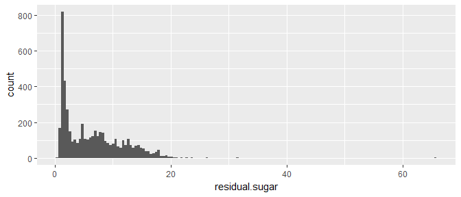
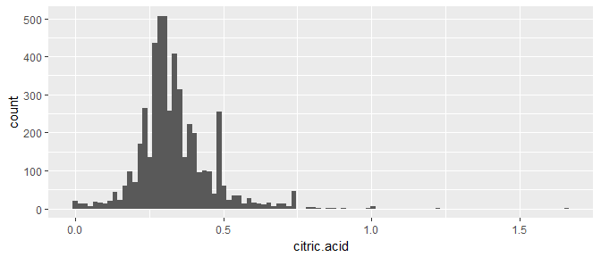
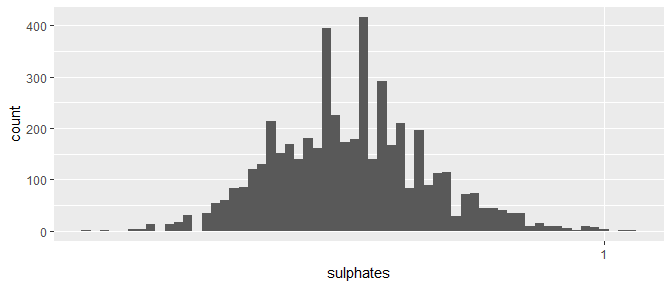
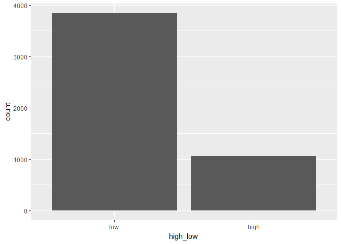
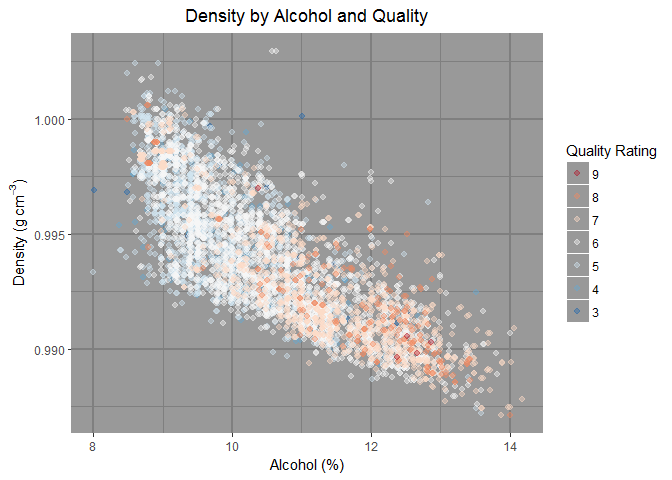

Exploring White Wines
================
Daniel Evans
2/27/2017

Univariate Plots Section
========================

In this project, we will be exploring what chemical and physical properties of white wines determine their qualiity. The `wines` dataset (found at [this link](https://www.google.com/url?q=https://s3.amazonaws.com/udacity-hosted-downloads/ud651/wineQualityWhites.csv&sa=D&ust=1487113245445000&usg=AFQjCNGiTBcgJFA2RXpR9o5t2XQ1-pcnow) with the following [description](https://s3.amazonaws.com/udacity-hosted-downloads/ud651/wineQualityInfo.txt)) contains 12 variables with almost 5000 observations. The `X` column is a redundant index, so I do not count it as a unique variable.

    ## [1] 4898   12

    ## 'data.frame':    4898 obs. of  12 variables:
    ##  $ fixed.acidity       : num  7 6.3 8.1 7.2 7.2 8.1 6.2 7 6.3 8.1 ...
    ##  $ volatile.acidity    : num  0.27 0.3 0.28 0.23 0.23 0.28 0.32 0.27 0.3 0.22 ...
    ##  $ citric.acid         : num  0.36 0.34 0.4 0.32 0.32 0.4 0.16 0.36 0.34 0.43 ...
    ##  $ residual.sugar      : num  20.7 1.6 6.9 8.5 8.5 6.9 7 20.7 1.6 1.5 ...
    ##  $ chlorides           : num  0.045 0.049 0.05 0.058 0.058 0.05 0.045 0.045 0.049 0.044 ...
    ##  $ free.sulfur.dioxide : num  45 14 30 47 47 30 30 45 14 28 ...
    ##  $ total.sulfur.dioxide: num  170 132 97 186 186 97 136 170 132 129 ...
    ##  $ density             : num  1.001 0.994 0.995 0.996 0.996 ...
    ##  $ pH                  : num  3 3.3 3.26 3.19 3.19 3.26 3.18 3 3.3 3.22 ...
    ##  $ sulphates           : num  0.45 0.49 0.44 0.4 0.4 0.44 0.47 0.45 0.49 0.45 ...
    ##  $ alcohol             : num  8.8 9.5 10.1 9.9 9.9 10.1 9.6 8.8 9.5 11 ...
    ##  $ quality             : int  6 6 6 6 6 6 6 6 6 6 ...

    ##  fixed.acidity    volatile.acidity  citric.acid     residual.sugar  
    ##  Min.   : 3.800   Min.   :0.0800   Min.   :0.0000   Min.   : 0.600  
    ##  1st Qu.: 6.300   1st Qu.:0.2100   1st Qu.:0.2700   1st Qu.: 1.700  
    ##  Median : 6.800   Median :0.2600   Median :0.3200   Median : 5.200  
    ##  Mean   : 6.855   Mean   :0.2782   Mean   :0.3342   Mean   : 6.391  
    ##  3rd Qu.: 7.300   3rd Qu.:0.3200   3rd Qu.:0.3900   3rd Qu.: 9.900  
    ##  Max.   :14.200   Max.   :1.1000   Max.   :1.6600   Max.   :65.800  
    ##    chlorides       free.sulfur.dioxide total.sulfur.dioxide
    ##  Min.   :0.00900   Min.   :  2.00      Min.   :  9.0       
    ##  1st Qu.:0.03600   1st Qu.: 23.00      1st Qu.:108.0       
    ##  Median :0.04300   Median : 34.00      Median :134.0       
    ##  Mean   :0.04577   Mean   : 35.31      Mean   :138.4       
    ##  3rd Qu.:0.05000   3rd Qu.: 46.00      3rd Qu.:167.0       
    ##  Max.   :0.34600   Max.   :289.00      Max.   :440.0       
    ##     density             pH          sulphates         alcohol     
    ##  Min.   :0.9871   Min.   :2.720   Min.   :0.2200   Min.   : 8.00  
    ##  1st Qu.:0.9917   1st Qu.:3.090   1st Qu.:0.4100   1st Qu.: 9.50  
    ##  Median :0.9937   Median :3.180   Median :0.4700   Median :10.40  
    ##  Mean   :0.9940   Mean   :3.188   Mean   :0.4898   Mean   :10.51  
    ##  3rd Qu.:0.9961   3rd Qu.:3.280   3rd Qu.:0.5500   3rd Qu.:11.40  
    ##  Max.   :1.0390   Max.   :3.820   Max.   :1.0800   Max.   :14.20  
    ##     quality     
    ##  Min.   :3.000  
    ##  1st Qu.:5.000  
    ##  Median :6.000  
    ##  Mean   :5.878  
    ##  3rd Qu.:6.000  
    ##  Max.   :9.000

Quality ratings are discrete and run from 3 to 9. Most of them are middling in quality, with a median rating of 6, with very few being rated 9 (5). So many wines are rated 6 that the median and 3rd quartile are the same.

    ##    Min. 1st Qu.  Median    Mean 3rd Qu.    Max. 
    ##   3.000   5.000   6.000   5.878   6.000   9.000

    ## 
    ##    3    4    5    6    7    8    9 
    ##   20  163 1457 2198  880  175    5

    ##    Min. 1st Qu.  Median    Mean 3rd Qu.    Max. 
    ##  0.9871  0.9917  0.9937  0.9940  0.9961  1.0390

There are three major outliers, all corresponding to wines with high sugar content.

    ##      density residual.sugar quality
    ## 1654 1.01030           31.6       6
    ## 1664 1.01030           31.6       6
    ## 2782 1.03898           65.8       6

Here's what the density distribution looks like with the outliers removed. We will return to these specific outliers in later sections.

The resultant plot looks slightly right-skewed.

Sugar data seems a bit skewed, so I log-transformed the x-axis, revealing a bimodal distribution with a valley between 3-4 g/dm3. So while the high-density outliers have high residual sugar content, the actual shape of the residual sugar distribution differs markedly from that of the density.

All of these chemical properties fall on normal distributions, with the exception of `volatile.acidity` and `sulphates`, which are log-transformed, and `total.sulfur.dioxide` and `free.sulfur.dioxide`, which are square-root-transformed.

    ##    Min. 1st Qu.  Median    Mean 3rd Qu.    Max. 
    ## 0.00900 0.03600 0.04300 0.04577 0.05000 0.34600

    ##   98% 
    ## 0.117

The histogram for `chlorides` has many outliers larger than 0.1. Here's what the distribution for `chlorides` looks like with 98% percent of the data.

    ## 
    ## 10.0333333333333             10.1 10.1333333333333            10.15 
    ##                1              114                2                3 
    ##             10.2             10.3             10.4 10.4666666666667 
    ##              130               85              153                2 
    ##             10.5 10.5333333333333            10.55 10.5666666666667 
    ##              160                1                2                1 
    ##             10.6            10.65             10.7             10.8 
    ##              114                1               96              135 
    ##             10.9 10.9333333333333 10.9666666666667            10.98 
    ##               88                2                3                1

    ##    Min. 1st Qu.  Median    Mean 3rd Qu.    Max. 
    ##    8.00    9.50   10.40   10.51   11.40   14.20

The `alcohol` content in wines have a slightly right-skewed distribution. Most of the alcohol counts have three significant figures (e.g. 10.3), with decimals ending in the tenths place. This explains the gaps in the distribution.

Now let's divide the `quality` variable into high (`quality > 6`) and low (`quality <= 6`) categories.

In the above frequency polygon, it looks like there tends to be more alcohol content in high (`quality > 6` in orange) vs low quality (`quality <= 6` in black) wines. To smooth out the jagged edges caused by binning, let's use a kernel density estimator to plot alcohol distributions for high and low wines.

Let's try looking at high to low comparisons for other features:

There seems to be no real difference between low and high quality wines with respect to each of the acidic properties of the wine. Let's see what happens when we add up the acidic content of the wines, creating a new feature called `acids`. The units are still in g/dm3.

    ##    Min. 1st Qu.  Median    Mean 3rd Qu.    Max. 
    ##   4.130   6.890   7.405   7.467   7.960  14.960

Alas, there seems to be no meaningful difference.

High-quality wines tend to have lower density than low-quality wines, which suggests that a combination of high alcohol content and low residual sugar wines will have lower density and will more likely be a higher quality wine.

There are only 5 white wines that have a quality rating of 9. Let's take a look at their features:

    ##      fixed.acidity volatile.acidity citric.acid residual.sugar chlorides
    ## 775            9.1             0.27        0.45           10.6     0.035
    ## 821            6.6             0.36        0.29            1.6     0.021
    ## 828            7.4             0.24        0.36            2.0     0.031
    ## 877            6.9             0.36        0.34            4.2     0.018
    ## 1606           7.1             0.26        0.49            2.2     0.032
    ##      free.sulfur.dioxide total.sulfur.dioxide density   pH sulphates
    ## 775                   28                  124 0.99700 3.20      0.46
    ## 821                   24                   85 0.98965 3.41      0.61
    ## 828                   27                  139 0.99055 3.28      0.48
    ## 877                   57                  119 0.98980 3.28      0.36
    ## 1606                  31                  113 0.99030 3.37      0.42
    ##      alcohol quality acids
    ## 775     10.4       9  9.82
    ## 821     12.4       9  7.25
    ## 828     12.5       9  8.00
    ## 877     12.7       9  7.60
    ## 1606    12.9       9  7.85

This sample size is much too small to make meaningful generalizations, but these quality 9 wines tend to have low density and above average alcoholic content (with the exception of the first one, which also has high sugar content). Combining this with the above plots of high vs. low quality wines, it seems like high quality wines have low quantities of salts, sulfur, and sugar, and yet still have an above-average alcohol percentage.

Univariate Analysis
===================

### What is the structure of your dataset?

There are 4,898 white wines in the dataset with 12 features:

1.  `fixed.acidity`: fixed acidity (tartaric acid content) in g/dm3
2.  `volatile.acidity`: volatile acidity (acetic acid content) in g/dm3
3.  `citric.acid`: citric acid content ("freshness") in g/dm3
4.  `residual.sugar`: residual sugar content ("sweetness") in g/dm3
5.  `chlorides`: chloride content (salts) in g/dm3
6.  `free.sulfur.dioxide`: free sulfur dioxide content (prevents microbial growth and oxidation) in mg/dm3
7.  `total.sulfur.dioxide`: total sulfur dioxide content in mg/dm3
8.  `density`: density (g/cm3)
9.  `pH`: pH (0 = very acidic ----&gt; 14 = very basic)
10. `sulphates`: sulphate content (K2SO4) in g/dm3
11. `alcohol`: percent alcohol
12. `quality`: quality (0 = bad ----&gt; 10 = good)

With the exception of `quality`, each of these features are floating-point numerical values. The `quality` variable is an integer quantity, but for our purposes it may be converted to an ordered factor variable as there are only 7 possible values for `quality` in the data (3 through 9).

Stray observations:

-   Almost half (2,198) of white wines have a quality rating of 6.
-   Only 5 wines have the maximum quality rating of 9 in this dataset.
-   98% percent of white wines are less dense than water (water has a density of 1 g/cm3.
-   The average density is 0.994 g/cm3
-   The average pH is 3.188 (for reference, the pH of pure distilled water is 7.0)

### What is/are the main feature(s) of interest in your dataset?

The main feature of interest is `quality`. Many of the other features contribute to either the pH or density of a given wine. Therefore it would be good to see how `pH` and `density` affect the quality.

### What other features in the dataset do you think will help support your investigation into your feature(s) of interest?

Other features where we see some divergence between low and high quality wines are `chlorides`, `total.sulfur.dioxide`, and `alcohol`, alongside the more general `pH` and `density` features.

### Did you create any new variables from existing variables in the dataset?

I've tried consolidating the `fixed.acidity`, `volatile.acidity`, and `citric.acid` into a new feature called `acids`, but so far I haven't seen any many differences between high and low quality wines with this feature.

### Of the features you investigated, were there any unusual distributions? Did you perform any operations on the data to tidy, adjust, or change the form of the data? If so, why did you do this?

Although I had to log-transform or square root transform some of the plots, all except the `residual.sugar` and `alcohol` plots tend to look like normal distributions. The distribution of sugars appears bi-modal, perhaps even tri-modal, with a large peak at 1.5 g/dm3 and two smaller peaks straddling the 10 g/dm3 point. The histogram for alcohol content is right-skewed, with half of wines containing less than 10.4% alcohol. However, wines with quality rating greater than 6 have an alcohol distribution that is left-skewed, with half of wines containing more than 11.5% alcohol.

Bivariate Plots Section
=======================

    ##                      fixed.acidity volatile.acidity citric.acid
    ## fixed.acidity                 1.00            -0.02        0.29
    ## volatile.acidity             -0.02             1.00       -0.15
    ## citric.acid                   0.29            -0.15        1.00
    ## residual.sugar                0.09             0.06        0.09
    ## chlorides                     0.02             0.07        0.11
    ## free.sulfur.dioxide          -0.05            -0.10        0.09
    ## total.sulfur.dioxide          0.09             0.09        0.12
    ## density                       0.27             0.03        0.15
    ## pH                           -0.43            -0.03       -0.16
    ## sulphates                    -0.02            -0.04        0.06
    ## alcohol                      -0.12             0.07       -0.08
    ## quality                      -0.11            -0.19       -0.01
    ##                      residual.sugar chlorides free.sulfur.dioxide
    ## fixed.acidity                  0.09      0.02               -0.05
    ## volatile.acidity               0.06      0.07               -0.10
    ## citric.acid                    0.09      0.11                0.09
    ## residual.sugar                 1.00      0.09                0.30
    ## chlorides                      0.09      1.00                0.10
    ## free.sulfur.dioxide            0.30      0.10                1.00
    ## total.sulfur.dioxide           0.40      0.20                0.62
    ## density                        0.84      0.26                0.29
    ## pH                            -0.19     -0.09                0.00
    ## sulphates                     -0.03      0.02                0.06
    ## alcohol                       -0.45     -0.36               -0.25
    ## quality                       -0.10     -0.21                0.01
    ##                      total.sulfur.dioxide density    pH sulphates alcohol
    ## fixed.acidity                        0.09    0.27 -0.43     -0.02   -0.12
    ## volatile.acidity                     0.09    0.03 -0.03     -0.04    0.07
    ## citric.acid                          0.12    0.15 -0.16      0.06   -0.08
    ## residual.sugar                       0.40    0.84 -0.19     -0.03   -0.45
    ## chlorides                            0.20    0.26 -0.09      0.02   -0.36
    ## free.sulfur.dioxide                  0.62    0.29  0.00      0.06   -0.25
    ## total.sulfur.dioxide                 1.00    0.53  0.00      0.13   -0.45
    ## density                              0.53    1.00 -0.09      0.07   -0.78
    ## pH                                   0.00   -0.09  1.00      0.16    0.12
    ## sulphates                            0.13    0.07  0.16      1.00   -0.02
    ## alcohol                             -0.45   -0.78  0.12     -0.02    1.00
    ## quality                             -0.17   -0.31  0.10      0.05    0.44
    ##                      quality
    ## fixed.acidity          -0.11
    ## volatile.acidity       -0.19
    ## citric.acid            -0.01
    ## residual.sugar         -0.10
    ## chlorides              -0.21
    ## free.sulfur.dioxide     0.01
    ## total.sulfur.dioxide   -0.17
    ## density                -0.31
    ## pH                      0.10
    ## sulphates               0.05
    ## alcohol                 0.44
    ## quality                 1.00

To better illustrate the correlations between features, let's construct a heat map of the most correlated features.

The factors that are most correlated to quality are `alcohol` and `density`. Below is a pairwise plot matrix of the eight features plotted in the heatmap, after converting the `quality` variable into an ordered factor called `quality_factors`.

Let's take a closer look at some features and how they affect quality.

The boxplots for `residual.sugar`, `density`, and `chlorides` have large outliers, so let's see what their distributions look like when those outliers are removed.

With the exception of `alcohol` and `pH`, for wines rated 5 or higher, a smaller quantity of the feature involved will produce a better quality wine, but only weakly.

First looking at `alcohol`, we see that the average alcohol percentage increases for wines rated 5 or better. There are two noticable outliers for quality 8 and 9 wines though, having very low alcohol content with respect to the average of their grade.

As for `density`, there's a negative relationship, as the average density tends to go downward with increasing quality. There are three large outliers for wines rated 6. As we've seen above, this is due to a high sugar level in those particular wines. Let's check these outliers by plotting the densities of all 6-rated wines with densities greater than 1 g/cm3 against their sugar content.

As suspected, the more sugar a wine has, the greater its density, considering the greater density of sugar compared to alcohol or water. Here's the general trend.

The trend is quite linear. This is to be expected because we've already seen that the density and residual sugar are highly correlated.

    ## 
    ## Call:
    ## lm(formula = density ~ residual.sugar, data = wines)
    ## 
    ## Residuals:
    ##        Min         1Q     Median         3Q        Max 
    ## -0.0056862 -0.0011059  0.0001726  0.0011523  0.0155617 
    ## 
    ## Coefficients:
    ##                 Estimate Std. Error t value Pr(>|t|)    
    ## (Intercept)    9.909e-01  3.742e-05 26480.7   <2e-16 ***
    ## residual.sugar 4.947e-04  4.586e-06   107.9   <2e-16 ***
    ## ---
    ## Signif. codes:  0 '***' 0.001 '**' 0.01 '*' 0.05 '.' 0.1 ' ' 1
    ## 
    ## Residual standard error: 0.001628 on 4896 degrees of freedom
    ## Multiple R-squared:  0.7039, Adjusted R-squared:  0.7038 
    ## F-statistic: 1.164e+04 on 1 and 4896 DF,  p-value: < 2.2e-16

Residual sugar alone accounts for over 70% of the variance in the density. Similarly, alcohol content and total sulfur dioxide also affect the density of wines.

As we've seen before, the outliers are affected by the residual sugar in the wine, yet still the density has a linear dependence on the alcohol content and total sulfur dioxide. In the multivariate plots section, we will explore how both alcohol and sugar content affect the density.

Now let us see what would affect the alcohol content. The three most strongly correlated features to `alcohol` are `residual.sugar`, `chlorides`, and `total.sulfur.dioxide`.

With the exception of `chlorides`, these relationships appear to be weakly linear. But it is interesting to note that a lower quantity of chlorides tends to correspond to a more alcoholic wine.

Among other features, it is interesting that `fixed.acidity` is the biggest determinant of `pH`. However, `pH` data is quite noisy, so the relationship between `fixed.acidity` and `pH` is only roughly linear.

Bivariate Analysis
==================

### Talk about some of the relationships you observed in this part of the investigation. How did the feature(s) of interest vary with other features in the dataset?

The most highly correllated feature with `quality` is `density`. Less dense wines tend to be of higher quality, due to their greater alcohol content, lesser sugar content or a combination of the two (with a few exceptions). This is borne out by how quality increases as `alcohol` increases, although quality does not depend very much on `residual.sugar` alone. Furthermore, there is a linear trend between `density` and `total.sulfur.dioxide`. However, the relationship between `alcohol` and `residual.sugar` is quite weak. Overall, most relationships between other features tend to be linear, weakly linear, or not meaningfully related.

### Did you observe any interesting relationships between the other features (not the main feature(s) of interest)?

Although `fixed.acidity` is highly correlated with `pH`, their relationship is only weakly linear given how noisy `pH` data is.

### What was the strongest relationship you found?

here are strong linear relationships between `density`, `residual.sugar` and `alcohol` as anticipated in the univariate analysis section. Based on the R2 score of a linear fit between `density` and `residual.sugar` it was found that over 70% of the variability of wine densities are explained by their sugar content alone.

Multivariate Plots Section
==========================

Here's a better look at how density depends on both alcohol and sugar. We see that the alcohol contributes to the density by being on the lower portion of the scatterplot, but the trend is governed by the sugar content. In the facet plot, each of the quality facets isolates a region on the density vs. sugar plot where the alcohol content is (generally) high, while the sugar and density levels are low. Again, this demonstrates that the high-quality wines tend to have low densities, which depends on alcohol and sugar content. Here's another view of the same insight, this time using sugar as the color scale.

The density vs. alcohol plot forms the shape of a knife, whose lower edge corresponds to a region with low sugar content. As the quality increases, the edge and tip of this knife is isolated.

Let's form a simple linear model where density depends on a linear combination of alcohol percentage, residual sugar content, and total sulfur dioxide:

    ## 
    ## Calls:
    ## density_model: lm(formula = density ~ alcohol + residual.sugar, data = wines)
    ## density_model2: lm(formula = density ~ alcohol + residual.sugar + total.sulfur.dioxide, 
    ##     data = wines)
    ## density_model3: lm(formula = density ~ alcohol + residual.sugar + total.sulfur.dioxide + 
    ##     free.sulfur.dioxide + fixed.acidity + chlorides, data = wines)
    ## density_model4: lm(formula = density ~ alcohol + residual.sugar + total.sulfur.dioxide + 
    ##     free.sulfur.dioxide + fixed.acidity + chlorides + pH, data = wines)
    ## 
    ## =======================================================================================
    ##                         density_model  density_model2  density_model3  density_model4  
    ## ---------------------------------------------------------------------------------------
    ##   (Intercept)             1.005***        1.003***        0.999***        0.986***     
    ##                          (0.000)         (0.000)         (0.000)         (0.000)       
    ##   alcohol                -0.001***       -0.001***       -0.001***       -0.001***     
    ##                          (0.000)         (0.000)         (0.000)         (0.000)       
    ##   residual.sugar          0.000***        0.000***        0.000***        0.000***     
    ##                          (0.000)         (0.000)         (0.000)         (0.000)       
    ##   total.sulfur.dioxide                    0.000***        0.000***        0.000***     
    ##                                          (0.000)         (0.000)         (0.000)       
    ##   free.sulfur.dioxide                                    -0.000***       -0.000***     
    ##                                                          (0.000)         (0.000)       
    ##   fixed.acidity                                           0.001***        0.001***     
    ##                                                          (0.000)         (0.000)       
    ##   chlorides                                               0.003***        0.005***     
    ##                                                          (0.001)         (0.000)       
    ##   pH                                                                      0.004***     
    ##                                                                          (0.000)       
    ## ---------------------------------------------------------------------------------------
    ##   R-squared                   0.907           0.911           0.936           0.961    
    ##   adj. R-squared              0.907           0.911           0.936           0.961    
    ##   sigma                       0.001           0.001           0.001           0.001    
    ##   F                       23791.076       16738.603       11882.257       17368.912    
    ##   p                           0.000           0.000           0.000           0.000    
    ##   Log-likelihood          27328.019       27448.397       28242.961       29484.775    
    ##   Deviance                    0.004           0.004           0.003           0.002    
    ##   AIC                    -54648.037      -54886.794      -56469.921      -58951.550    
    ##   BIC                    -54622.051      -54854.311      -56417.949      -58893.080    
    ##   N                        4898            4898            4898            4898        
    ## =======================================================================================

Even with outliers, the fit is remarkably good, with an R2 of at least 91% for just `alcohol` and `residual.sugar`, suggesting that variability in sugar content and alcohol mostly determines the variability in wine density. Other features like `free.sulfur.dioxide`, `fixed.acidity`, and `chlorides` do not improve the R2 by very much. Even `total.sulfur.dioxide` contributed to less than 1% of the R2 value. Surprisingly, `pH` adds almost 3%, considering that the density-pH relationship is flat.

Here are the density plots with diverging color palettes encoding wine quality.

Multivariate Analysis
=====================

### Talk about some of the relationships you observed in this part of the investigation. Were there features that strengthened each other in terms of looking at your feature(s) of interest?

Both `alcohol` and `residual.sugar` contribute to the density of wines. As we facet either a `density` vs. `alcohol` or `density` vs. `residual.sugar` plot by `quality_factors`, we notice that for a higher rated wine, the density and sugar levels tend to be lower, and the alcohol levels are higher. However, there are plenty of high alcohol, low density wines that are lower rated as well.

### Were there any interesting or surprising interactions between features?

Although the pH has a linear relationship with density, it is mostly flat, meaning that the pH may vary without the density changing for a wide range of pH values. Despite this, variability of the pH contributes more to the variability of the density than chlorides or the total sulfur dioxide content, despite their stronger correlation with the density.

### OPTIONAL: Did you create any models with your dataset? Discuss the strengths and limitations of your model.

Yes, I created a linear model of the density of wines, considering their alcohol and sugar content. These two variables alone account for over 90% of the variability of density. Adding other variables like `total.sulfur.dioxide`, `free.sulfur.dioxide`, `fixed.acidity` and `chlorides` only adds a couple of percentage points to the R2 score.

Unfortunately, this model is insufficient for predicting the quality rating of a given wine, because density (and all the factors that influence it) is not a good indicator for determining low quality wines.

------------------------------------------------------------------------

Final Plots and Summary
=======================

### Plot One

### Description One

This kernel density plot of alcohol distributions for low and high quality wines shows that highly rated wines tend to have more alcohol than low-rated wines.

### Plot Two

### Description Two

The highest rated wines (7-9) have the lowest densities. The spread of density data is wide for middle-rated wines (5-6), with large outliers (not pictured) for 6-rated wines due to abnormally high sugar content.

### Plot Three

### Description Three

Each rating forms a layer in the scatterplot, with the highest quality wines (in red) forming the topmost layers. The highest quality wines tend to have low densities and high alcohol content compared to the lowest-rated wines (in blue).

------------------------------------------------------------------------

Reflection
==========

I explored a dataset of around 5000 white wines to help answer the question: "What chemical and physical properties of white wines determine their quality?" There was a total of 12 features to explore, including the quality rating. I first examined each of them individually, then pursued some further questions generated by this initial examination, eventually observing interactions over multiple variables.

At first I looked at distributions of certain physical and chemical quantities like density, pH, sugar content and alcohol content. Then I found that if I were to examine distributions by rating, I could see what made high quality wines different from low quality wines. I discovered such differences with the `density` and `alcohol` variables most notably. All the while I checked inter-feature correlations as a guide as to which features contribute to affecting these variables the most. Observing the `density` distribution as a function of quality rating led me to discover three major outliers with very high densities. This tipped me off to surmise that the sugar content (which also had a few major outliers) has a large impact on density, which I confirmed by making a density vs. sugar plot and noticing a strong linear trend. Alcohol content should also affect density, so I examined that relationship as well. One surprising yet unexplained observation I found is that the pH also affects density but only in terms of its variability, because adding pH into the density model improved the R2 score more than any other quantity except sugar and alcohol.

I have yet to make any accurate models for the quality of wines based on factors like `density` or `alcohol`. While high quality wines have low densities, low sugar, and a high alcohol percentage, there are plenty of middling and low quality wines with those attributes as well. It was difficult for me to find anything that distinguishes a low-rated (3-4) wine from a middle-rated wine (5-6). In future work, I would try to incorporate more of the other seemingly less correlated features into the analysis, since I discovered that high quality wines tend to have low quantities of chlorides and sulfur dioxide, while low quality wines have high fixed acidities. How these features affect wine quality are more subtle and would probably require a bit more knowledge as to how they change the taste, color and smell of wines, which are major factors in judging wine quality.
